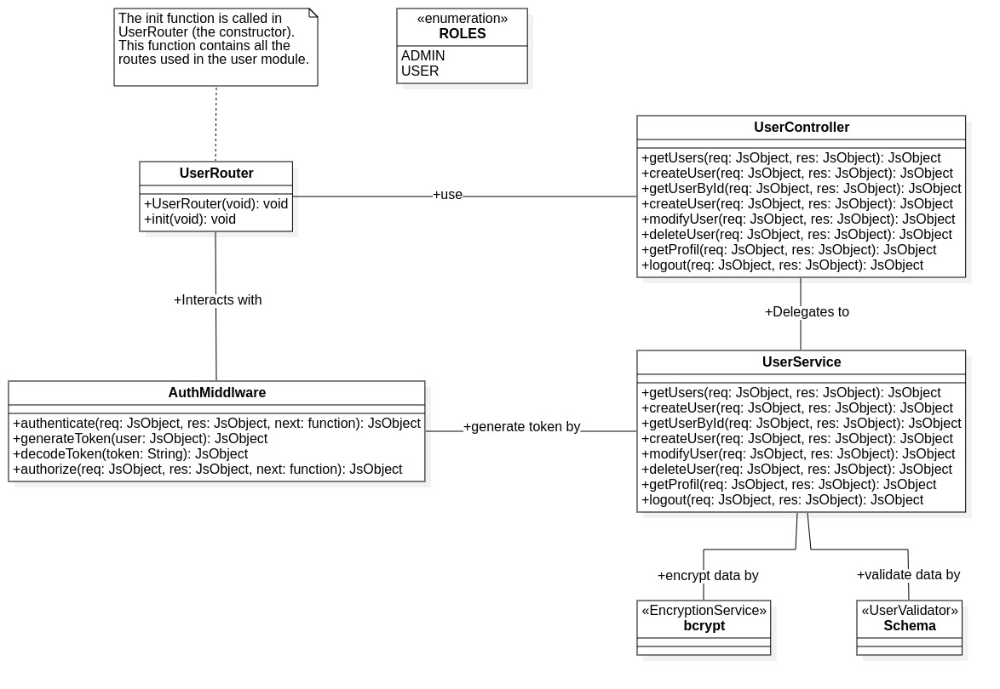

# User Module

## 📘 **Introduction**

Ce module est responsable de fournir les différentes `API` possibles qui seront utilisées pour les opérations de gestion des utilisateurs. Il contient des `API` pour la création, la modification, la suppression, ainsi que la récupération des informations des utilisateurs ou d'un utilisateur en particulier (par son ID). Ce module utilise l' `AuthModule`, qui fournit des middleware pour l’authentification, l’autorisation et la génération de tokens, en utilisant le service `JWT`.

## 🏗️ **Architecture générale**

### 🟢 Diagramme de classes




### 🟢 Explication

➡️ **La classe `UserRouter` est le point d'entrée du système.**

🔹 **La méthode `init` est responsable de la configuration complète des routes du module : elle associe chaque route à sa fonction de traitement, et intègre tous les middlewares nécessaires (authentification, validation, etc.).**

Voici un exemple du code de la classe `UserRouter` :

```jsx
    init()
    {

        // Define GET route for fetching users
        this.router.get     (
                                '/',
                                AuthMiddleware.authenticate,
                                AuthMiddleware.authorize,
                                async (req, res) => { return UserController.getUsers(req, res);    }
                            );

        // Define POST  route for create new user
        this.router.post    (
                                '/',
                                async (req, res) => { return UserController.createUser(req, res);  }
                            );
```
